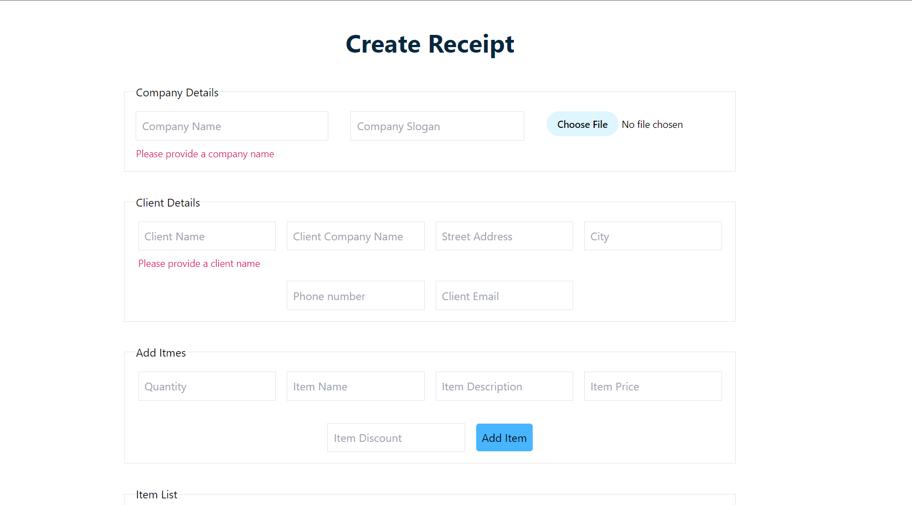

# Payment Voucher App
 An appliaction that generates an invoice for items purchased

 ### Screenshot

## Built With

- Reactjs
- Redux
- Tailwindcss

## Live Demo
> [Payment Voucher App](https://payment-voucher.vercel.app/)

## Getting Started

To get a local copy up and running follow these simple example steps.

- Clone the repo to your local environment
- Run npm install to install all dependencies
- Run npm run dev to open in your browser
- Modify to your taste with your preferred text editor
- Enjoy :hugs:

## Authors

👤 **Kwasi Baayeh**

- GitHub: [@githubhandle](https://github.com/Baayeh)
- LinkedIn: [LinkedIn](https://linkedin.com/in/kabaayeh)
- Twiiter: [Twitter](https://twitter.com/Cest_Baayeh)

## Acknowledgement
- 

## 🤝 Contributing

Contributions, issues, and feature requests are welcome!

Feel free to check the [issues page](../../issues/).

## Acknowledgments

- [Stephen Adom](https://github.com/Stephen-Adom)
 
